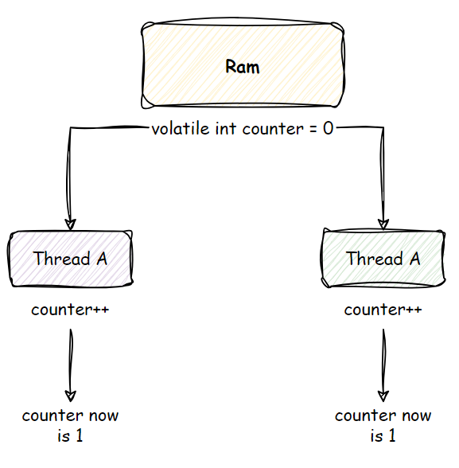

## Java

### Core / Advanced
- **Blocking Queue**: see example at `com.duylv.service.TaskService`
- **Collections**:
  - **HashMap**: collision
      > Keep in mind that it’s the hash value of the key that determines the bucket the object will be stored in. And so, if the hash codes of any two keys collide, their entries will still be stored in the same bucket (implemented by LinkedList).

### Memory Allocation:
- **Stack**:
- **Heap**: // TODO: deep dive to garbage collection.

### Pass By Value:
- **Why java is pass by value**: https://stackoverflow.com/questions/40480/is-java-pass-by-reference-or-pass-by-value
  
### Keywords
- **Volatile**: Make sure that, all threads are reading/writing to latest value in main memory
(only suitable for simple operation, not for atomic operation, as example below). It only ensures that when you view value, 
you will see latest value, but not ensure you update on latest value. 
  
- **Static**: static block, variables are loaded at first when class's loaded by ClassLoader. Static things is managed by JVM, and thread-safe.
- **Synchronized**: to make process handled synchronously using lock mechanism. It's expensive, but why?
  - **Locking.**
  - **Context Switching:** if a thread is waiting for a lock that is held by another thread, the Java Virtual Machine (JVM) needs to perform a context switch, which involves saving the current thread's state and restoring the state of the thread that holds the lock.

### Non-blocking
- **I/O and Concurrency**: Implementing non-blocking I/O and concurrency mechanisms in Java applications.

### Threading
- **ThreadLocal**: use to store data for each thread like user logged in info, user JWT token, etc.
- **Deadlock**: Identifying and resolving deadlocks in multithreaded applications. Using `Reentrant Lock` to prevent `DeadLock` (timeout for locking)
- **Race Condition**: Preventing race conditions through proper synchronization. ([Source Code](https://github.com/duylv27/theory/tree/main/threading-sample/threading)).
  To handle **race-condition**, we need to be aware of term **Mutual Exclusion** which states that "no two processes can exist in the critical section at any given point of time". So below are certain ways to apply **MUTEX**
  - **Reentrant Lock**:
    - **Pros**: Flexible (e.g., `tryLock()`, `tryLock(time, time)`), useful for complex processes, can be conditional, cost-effective.
    - **Cons**: Complex to implement.
  - **Synchronized**: Ensures all-or-nothing execution, involves context switching (costly).
  - **Atomic**: Safe and effective for managing variables.
    - **CAS**:
      1. First, get value.
      2. Then, increase value.
      3. Check if current value is different from the on get at (a), retry from a-c until it pass.
      > CAS (Compare-And-Set) doesn't care about how the value was incremented or from which specific value—it just cares about the current state at the moment of comparison.
